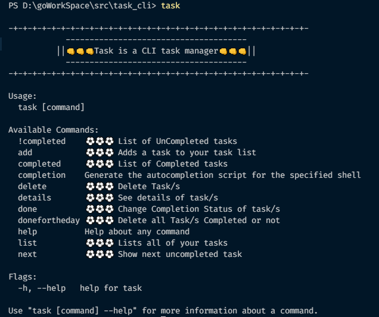
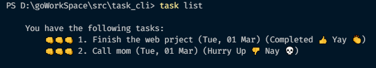
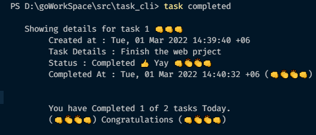
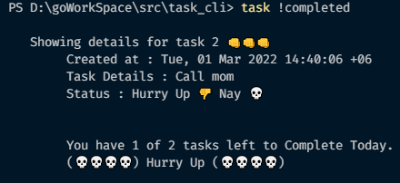
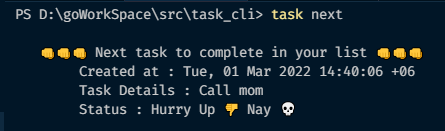

# Task CLI

Task cli is a command line tool for task management. 
This exercise is taken from [john calhouns](https://www.calhoun.io/) gophercises course. Written in 100% GO. Uses boltdb for local storage.  

## Usage
---
### Complete Usage

___
### Task View

___

### Completed Tasks

___

### Not Completed Tasks

___

### Next Task to focus

# Installation
**Add [task.exe](cmd/task.exe) to your path**

### *About Me*
*Ahmed Bin Nasser* 
gmail : ahmedmunna172367@gmail.com 
git : [ahmedMunna1767](https://github.com/ahmedMunna1767)
